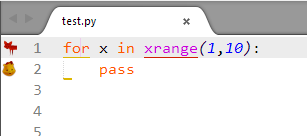
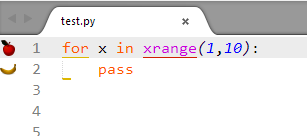
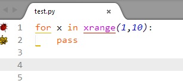
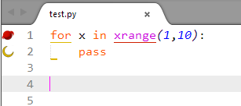

# Wildlife Theme
This is a sublime linter theme that saves you the annoyance of the default Error/warning gutter theme.

### Features
Comes with four different lints.

#### Animals
* Fox --> error
* cat --> warning

#### Fruits
* Apple --> error
* Banana --> warning

#### Insects
* Ladybird --> error
* Bee --> warning

#### Planetary bodies
* Sun --> error
* Moon --> warning

## Installation
Open `Tools -> Command Palette...`. Search for `Package Control: Install Package` and then search for `SublimeLinter_WildlifeTheme`
	

Open Sublime's command palette `CMD + Shift + P` or `Ctrl + Shift + P`

Select `SublimeLinter: Choose Gutter Theme`
Find Wildlife themes in list

To get a better experience, combine it with the Wildlife theme. 

> This gutter theme is not needed if you already have [Wildlife](https://packagecontrol.io/packages/Wildlife) color scheme **v2.0.0** and above as it already comes with it + configurations so you do not have to do any editing. It also has over 100 language syntax highlighting capabilities.

## Acknowledgements
All glory belongs to God.

